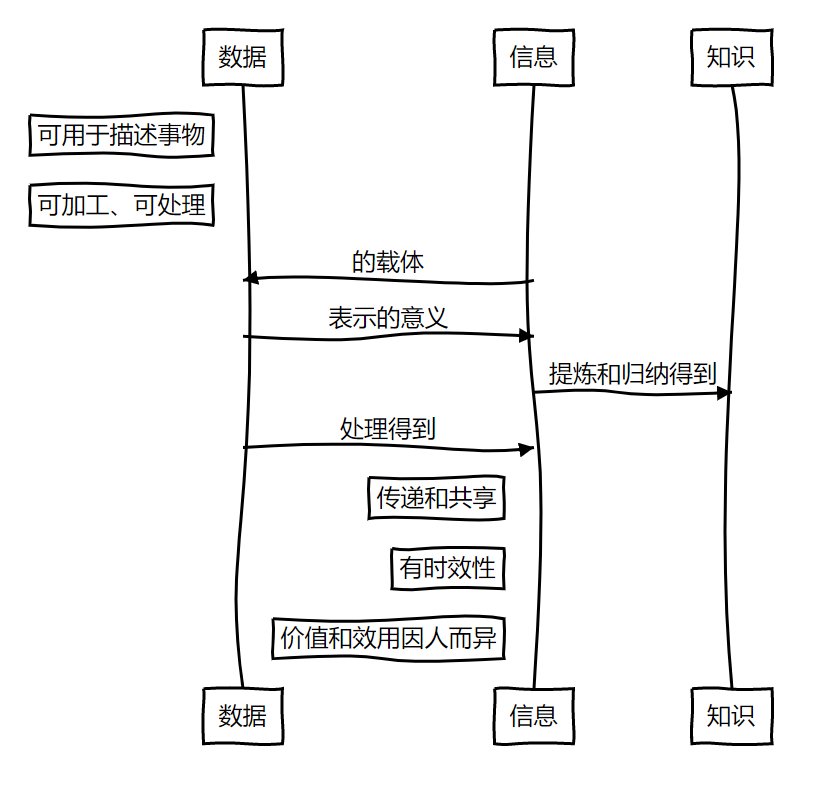

# 信息技术快速复习指南（试读版）

🔰*本文由铜芯圆团队100%原创，并经过**桂明老师**和**袁中果老师**认证*

## 本指南正确食用方法

你好！这份指南可以帮你迅速复习高一信息技术的各种知识，从而在信息技术学考中取得好成绩。

### 适合人群

以下人群适合马上开始阅读：

* 认真听**过**信息技术课的同学
* 已掌握Python基础知识的同学
* Python高手
* 有其它语言编程经验的同学
* 知道什么是python的同学

以下人群不适合阅读本指南：

* 不知道什么是Python的同学

不适合人群建议在阅读本指南前进行以下活动：

* 百度百科查看什么是Python

### 格式约定

本文主要使用以下格式：

* 正文：普通文本

* **加粗文本**：表示要强调的内容

* ==高亮文本==：桂明老师和某巨佬给出的建议

* *斜体文本*：表示拓展内容，虽然学考不考，但是有助于你进行理解。如果你看不懂部分斜体内容，直接忽略就好

* `代码`：一般是在一个知识点后面的示例

* ```
  代码块：
  和代码的用途相同，只不过是多行的
  ```

* [超链接](#格式约定)：你在看到一些内容的时候可能有点忘了之前的内容，所以我们在部分原来出现过的名词中加上超链接，点击这个链接可以快速跳转到之前对这个名词的定义。在有特殊注明的情况下，超链接也有可能指向其它网站。

* <kbd>按键</kbd>：表示需要你按下的按键，通常可以在键盘上找到

* > 提示：你在操作过程中可能遇到的问题

## 准备工作

> 提示：“准备工作”是你需要在电脑上进行的、为了与学考所用计算机保持一致的配置，这些配置无需在学考时进行。

### 1. 安装 Python

访问`https://www.python.org/downloads`或者直接[点击此处](https://www.python.org/downloads)访问Python官方下载页，并下载最新版本的Python。

> 提示：学考计算机使用的版本是Python 3.7，但是你仍然可以安装Python 3.8，因为学考测试的特性在Python 3.8中未被修改。

下载完成后安装，:warning:请注意安装时<strong>钩选“Add Python to PATH”</strong>，这一点非常重要！

> 提示：钩选Add Python to PATH让你能够很方便地打开Python和pip。

如果你之前已经安装过Python，按下<kbd>Windows</kbd>+<kbd>R</kbd>组合键，然后输入`python`并回车，如果打开了Python就一切正常；如果提示“Windows找不到文件'`python`'”，请从控制面板卸载Python，然后重新安装。

### 2. 安装学考需要的扩展包

学考需要使用一些第三方Python包，请按如下步骤进行安装：

1. 按下<kbd>Windows</kbd>+<kbd>R</kbd>组合键，输入`cmd`回车；

2. 在命令行窗口输入`pip install numpy matplotlib pandas xlrd -i https://pypi.tuna.tsinghua.edu.cn/simple`，回车，坐等安装完成。

   > 提示：如果提示`'pip'不是可执行文件`，请检查你的Python是否正确安装。

在python中输入`import numpy,matplotlib,pandas,xlrd`来查看是否安装成功：如果没有任何输出，说明安装成功；如果有错误提示，说明安装失败。

## 一、数据与大数据（20分）

### 1.基本概念

数据：描述事物的符号记录。

信息：依附字符等载体，通过各种途径进行传播，能够帮助获取者了解情况、形成判断或做出决策的内容。

知识：人们在实践中所获得的认识和经验的总和、认识世界的成果。

二者的特征与关系如图:arrow_down:



### 2.关于数字化（即信息→数据）

#### (1)数字化

把信息转变为数据，便于获取数据，存储、处理、传输信息。

#### (2)数字化的方式：两种。

**数字信号**：散点，离散的。.png)

**模拟信号**：拟合函数，连续的。.jpg)

#### (3)进制问题

### 3.计算机常识

### 4.字符编码

### 5.图像与视频

### 6.音频

### 7.压缩

### 8.大数据

## 二、程序与算法基础（50分）（Part 1）

## 二、使用Python进行编程（Part 2）

## 三、数据处理（26分）

## 四、智能时代（4分）

**试读已结束**
